# Takeover Quality EDA Report

This report summarizes exploratory analysis for takeover quality around manual disengagement events.

The figures were generated by:

```bash
python scripts/takeover_quality_eda.py \
  --dataset-root dataset \
  --events dataset/benchmark/takeover_events_or.csv \
  --output-dir reports/takeover_quality_eda
```

## Report Files

- [Post-event quality metrics](post_event_quality_metrics.csv)
- [Pre-event feature summary](pre_event_feature_summary.csv)
- [Pre-event missingness table](pre_event_missingness.csv)
- [Feature-target correlations](feature_target_correlations.csv)
- [NaN handling notes](nan_handling_notes.txt)

## Post-Event Takeover Quality

These plots describe the 3-second window after each takeover event, `[t_event, t_event + 3s]`.

| Reaction smoothness | Steering smoothness |
|---|---|
| 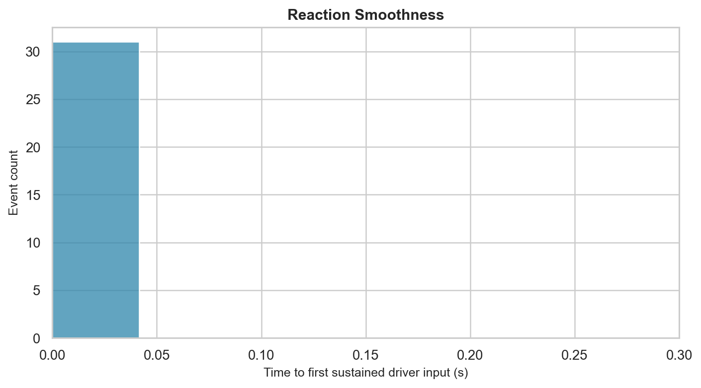 | 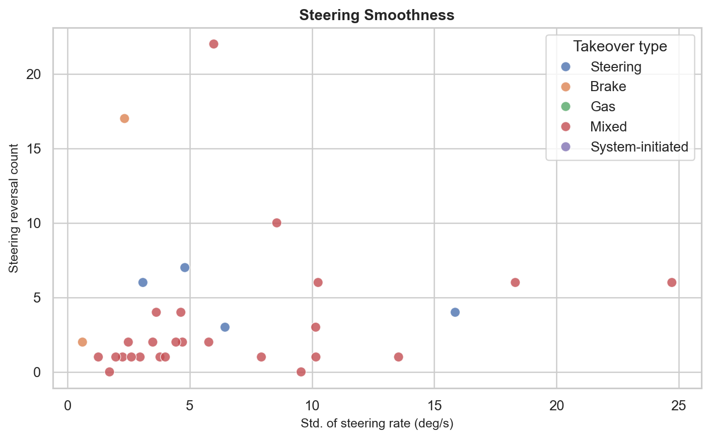 |

`target_reaction_time_distribution.png` shows the time from `t_event` to the first sustained driver input. Lower is faster.

`target_steering_smoothness_scatter.png` compares steering-rate variability against steering reversal count. Lower-left indicates smoother steering control.

| Longitudinal smoothness | Lateral stability |
|---|---|
| 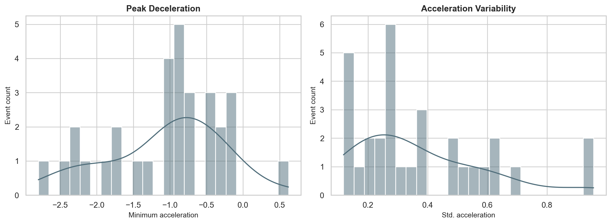 | 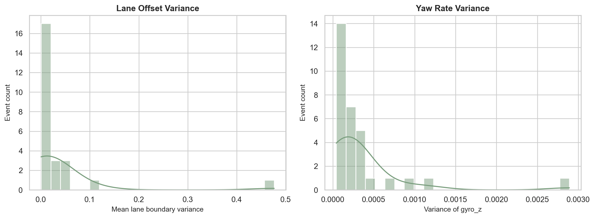 |

`target_longitudinal_smoothness.png` shows peak deceleration and acceleration variability after takeover.

`target_lateral_stability.png` shows lane-offset variance and yaw-rate variance after takeover.

### Normalized Quality Axes

Scores are min-max normalized to `[0, 1]`, where `1` indicates the smoothest or most stable observed behavior.

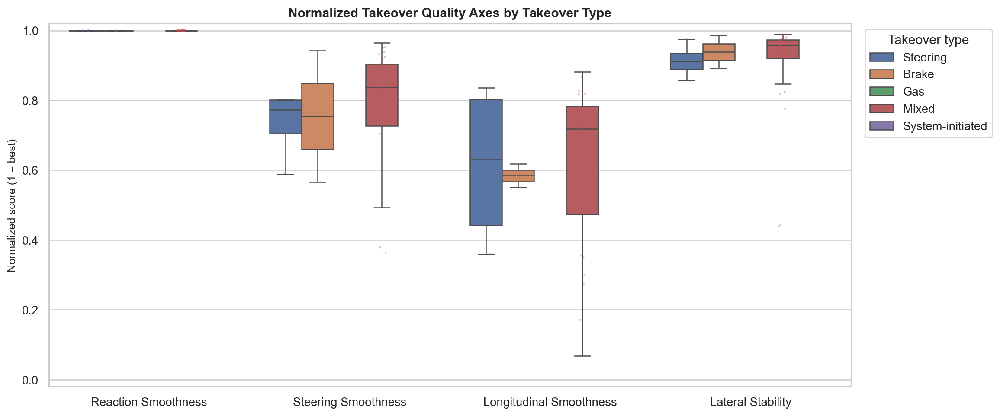

## Pre-Event Feature Distributions

These plots describe the 5-second feature window before each takeover event, `[t_event - 5s, t_event]`.

| Vehicle dynamics | Radar |
|---|---|
| 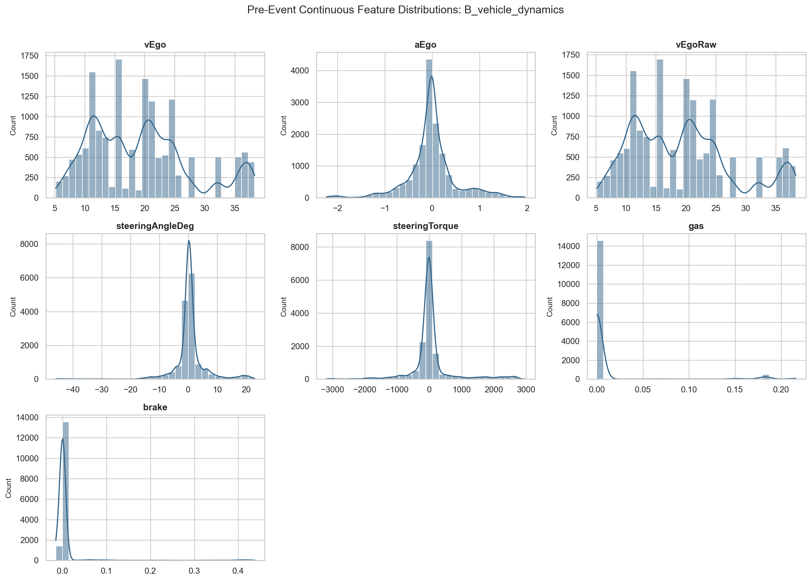 | 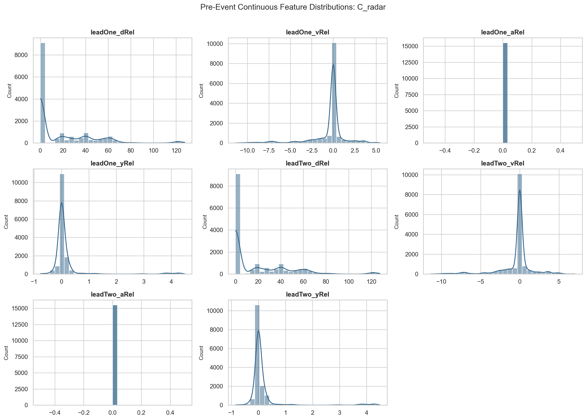 |

| Planner | IMU |
|---|---|
| 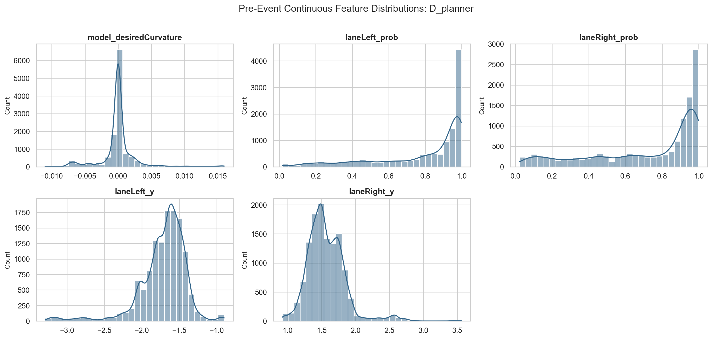 | 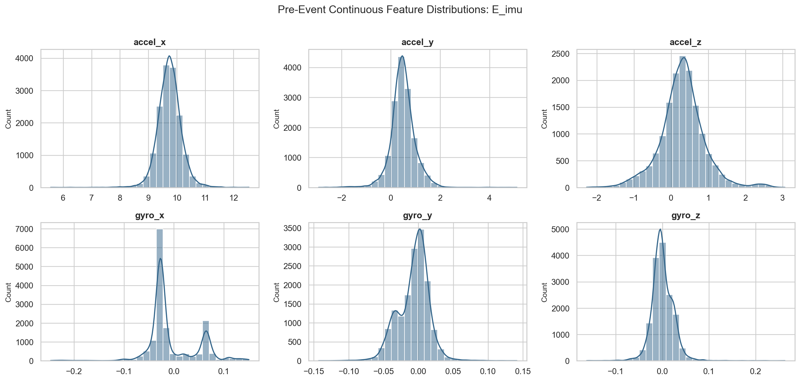 |

### Driver State

This figure summarizes readiness probabilities, awareness state, distraction type, and binary driver-state flags.

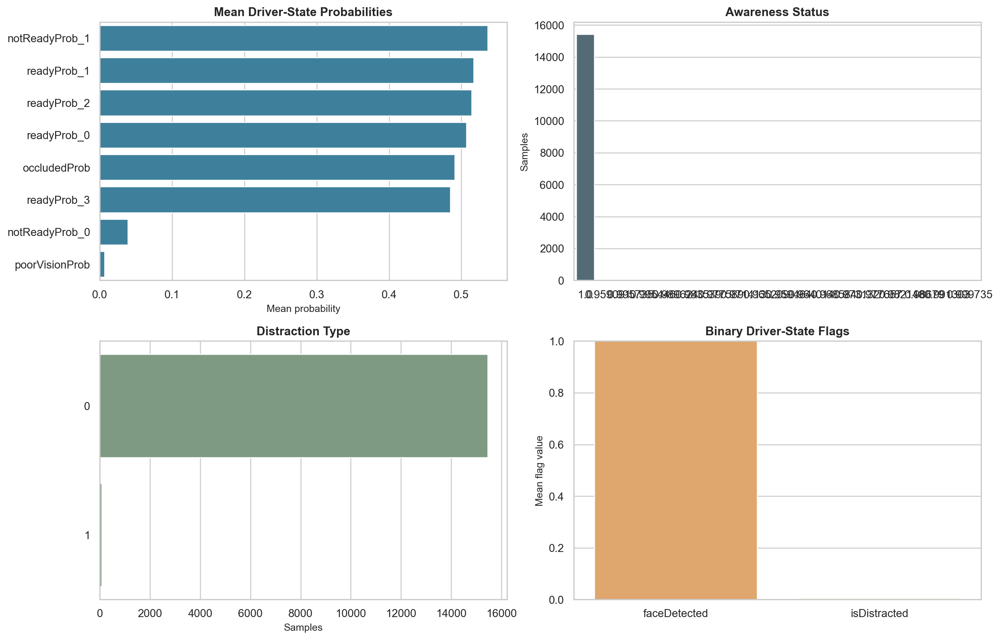

## Correlation and Relationship Analysis

### Feature-to-Feature Correlations

The clustered heatmap shows Pearson correlations among numeric pre-event features from vehicle dynamics, radar, planner, and IMU subsets. Blocks of strong color indicate potentially redundant or collinear features.

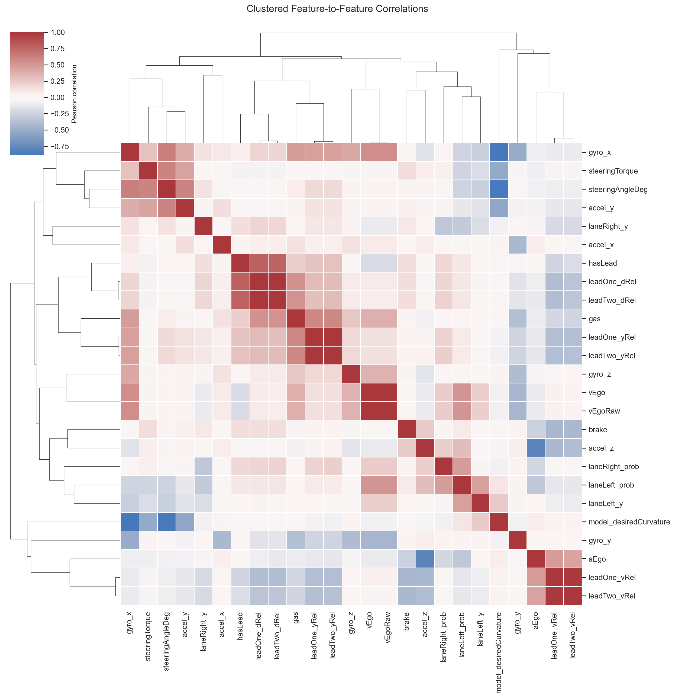

### Feature-to-Target Correlations

These figures show the strongest correlations between summarized pre-event features and post-event normalized quality axes.

| Pearson | Spearman |
|---|---|
| 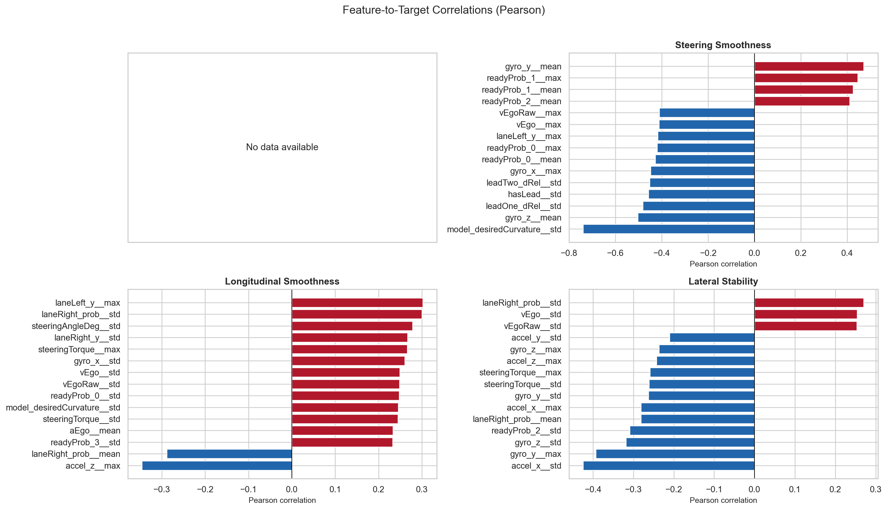 | 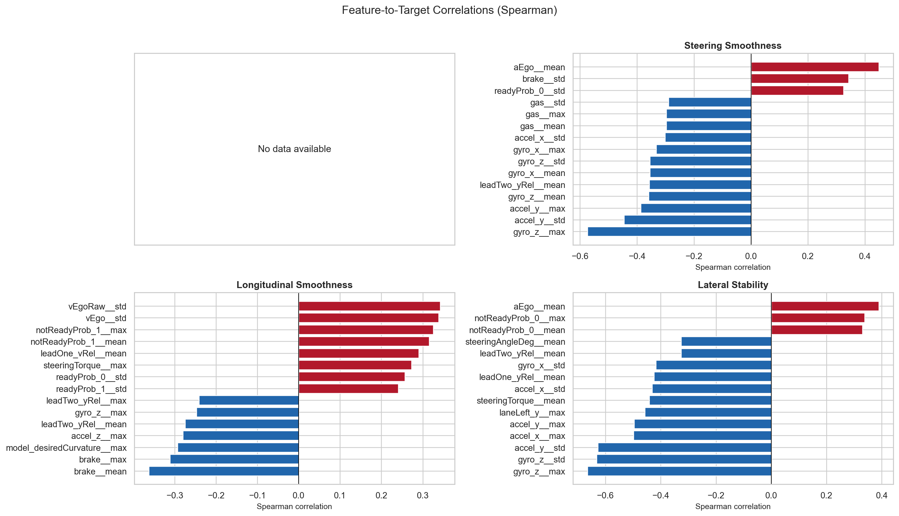 |

Pearson emphasizes linear relationships. Spearman emphasizes monotonic rank relationships and can be more robust when relationships are nonlinear.

## Interpretation Notes

- Missing values are not globally imputed in this EDA. See [NaN handling notes](nan_handling_notes.txt).
- For radar features, interpret `leadOne_*` and `leadTwo_*` values only when the matching `*_status` column indicates a valid lead object.
- The normalized quality axes are useful for comparison within this report, but the exact normalization depends on the observed range of the analyzed events.
